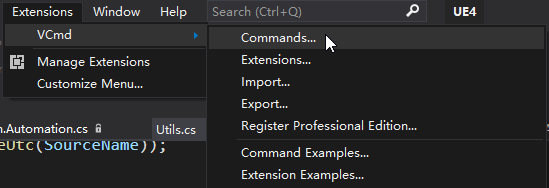
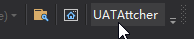

## 背景
我们debug的过程中，有时会碰到要Attach到某个进程的情况。遇到这种情况，一般来说就是Alt+D,P呼出AttachToProcess界面，然后找到进程->Attach。今天发现一个方法，可以一键直接开启Attach到指定的进程，而且具有一定的扩展性。本着好东西大家一起分享的原则，现记录如下。
 
## 原理
这个方法是利用VS的宏和库，将指令脚本化，类似Excel里的宏。脚本使用的语言是C#和VB。
那么如何运行这个脚本呢？这就需要引入VS的扩展**Visual Commander**了。
 
## 步骤
- *VS菜单栏->Extensions->Manage Extensions*搜Visual Commander（下称VCmd），先把它下下来
  

- 下载完成后，可在Extensions中找到VCmd，找到Commands，我们可以在这里添加自定义的指令
  

- 然后点Add，编辑页面出来了，语言可选C#或VB，我不会VB选了C#,可以看到用了DTE接口。可以起个名字，方便管理
  
  *(这里由于我添加过一个命令，所以是Command02)*

- 要运行的内容，按照我们的需求，就是找到指定的进程并Attach上去，我这里Attach的是AutomationTool
    ```csharp
    using EnvDTE;
    using EnvDTE80;

    public class C : VisualCommanderExt.ICommand
    {
        public void Run(EnvDTE80.DTE2 DTE, Microsoft.VisualStudio.Shell.Package package)
        {
            foreach(Process2 proc in DTE.Debugger.LocalProcesses)
            {
                if(proc.Name.ToString().Contains("AutomationToolLauncher.exe"))
                {
                    proc.Attach2("");
                    return;
                }
            }
            System.Windows.MessageBox.Show("AutomationToolLauncher not found.");
        }
    }
    ```
    记得保存XD

- 这个时候已经可以运行了，但是为了一键Attach，我们得把它绑定到一个按键上
  菜单栏找*Tools->Customize->Commands标签下*选择*ToolBar->Standard*，这里看个人习惯，我放到了工具栏上Standard栏，右侧*Add Command*找到要执行的Command
    
  Extensions目录下找到相应的Command，不记得是第几个可以在VCmd的Command编辑界面看看左上角

- 然后Preview里面选中后可以移动到合适的位置或者*Modify Selection*改个喜欢的名字
    
  改好了关上就行
  
- 当目标进程启动时，直接点我们添加的按钮，就可以Attach到了
    
  丝滑且优雅

## 最后
其他的一些功能和样例可以参考Extensions->VCmd->Command Examples/ Extension Examples或者前往*https://vlasovstudio.com/visual-commander/commands.html*（前39个在Examples中可以找到


就这样！Enjoy！

